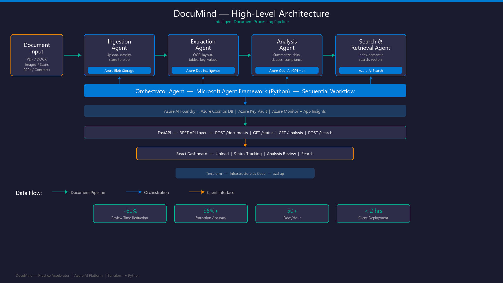

# DocuMind — Intelligent Document Processing Pipeline

> Multi-Agent AI Accelerator for RFPs, Contracts & Specifications



## Overview

DocuMind is a reusable practice accelerator that automates document review using a multi-agent AI pipeline built on Azure. It targets the pain of manual document review across client engagements — RFPs, contracts, and technical specifications — delivering ~60% reduction in review time.

## Tech Stack

| Layer | Technology |
|-------|-----------|
| **Language** | Python 3.11+ |
| **Agent Framework** | Microsoft Agent Framework (`agent-framework-azure-ai`) |
| **API** | FastAPI |
| **Frontend** | React |
| **IaC** | Terraform |
| **Deployment** | Azure Developer CLI (`azd`) |
| **CI/CD** | GitHub Actions |

## Azure Services

- **Azure AI Foundry** — Agent hosting, model catalog, evaluation
- **Azure OpenAI (GPT-4o)** — Summarization, risk analysis, clause extraction
- **Azure Document Intelligence** — OCR, layout, table & key-value extraction
- **Azure AI Search** — Semantic + vector search across processed documents
- **Azure Blob Storage** — Raw & processed document storage
- **Azure Cosmos DB** — Pipeline state, metadata, audit trail
- **Azure Key Vault** — Secrets management
- **Azure Monitor + App Insights** — Observability & tracing

## Project Structure

```
documind/
├── infra/                    # Terraform modules for all Azure resources
├── src/
│   ├── documind/
│   │   ├── core/             # Shared models, interfaces, config
│   │   ├── agents/           # Agent implementations
│   │   │   ├── ingestion/    # Upload, classify, store
│   │   │   ├── extraction/   # OCR, layout, tables
│   │   │   ├── analysis/     # Summarize, risks, clauses
│   │   │   ├── search/       # Index, semantic search
│   │   │   └── orchestrator/ # Pipeline workflow coordinator
│   │   ├── services/         # Azure SDK wrappers
│   │   └── api/              # FastAPI endpoints
│   └── web/                  # React frontend
├── tests/                    # Unit, integration, load tests
├── eval/                     # Evaluation datasets & evaluators
├── config/                   # Pluggable doc-type configurations
├── docs/                     # Architecture & setup guides
└── samples/                  # Demo document packs
```

## Quick Start

### Prerequisites

- Python 3.11+
- [Azure Developer CLI (`azd`)](https://learn.microsoft.com/azure/developer/azure-developer-cli/install-azd)
- [Terraform](https://www.terraform.io/downloads)
- Azure subscription with access to Azure OpenAI

### Setup

```bash
# Clone the repo
git clone <repo-url>
cd documind

# Create virtual environment
python -m venv .venv
source .venv/bin/activate  # Linux/Mac
# .venv\Scripts\activate   # Windows

# Install dependencies
pip install -e ".[dev]"

# Provision Azure infrastructure
cd infra
terraform init
terraform plan -out=tfplan
terraform apply tfplan

# Run the API
uvicorn documind.api.main:app --reload
```

### One-Command Deploy (with azd)

```bash
azd up
```

## Agents

| Agent | Responsibility | Azure Service |
|-------|---------------|---------------|
| **Ingestion** | Upload, classify, store documents | Azure Blob Storage |
| **Extraction** | OCR, layout, table/key-value extraction | Azure Document Intelligence |
| **Analysis** | Summarize, identify risks, extract clauses | Azure OpenAI (GPT-4o) |
| **Search & Retrieval** | Index and semantic search | Azure AI Search |
| **Orchestrator** | Sequential workflow coordination | Agent Framework Workflow |

## Adding a New Document Type

1. Create a config file in `config/doc-types/<type>.json`
2. Define extraction schema and analysis prompts
3. No code changes required — the pipeline auto-discovers new types

## Key Metrics

| Metric | Target |
|--------|--------|
| Review time reduction | ≥ 60% |
| Extraction accuracy | ≥ 95% |
| Pipeline throughput | ≥ 50 docs/hour |
| Client deployment time | ≤ 2 hours |

## Known Limitations

This accelerator is designed for rapid prototyping and client demos. The
following limitations apply out of the box and should be addressed before
a production deployment.

### Concurrency

- Document processing uses **FastAPI `BackgroundTasks`** (Starlette thread
  pool). Approximately **30–40 documents** can process concurrently, bounded
  by the default thread pool size.
- Each background task creates its own Azure SDK clients (OpenAI, Document
  Intelligence, Cosmos DB, Search). At high concurrency this adds connection
  overhead.
- There is **no durable queue** — if the server crashes or restarts,
  in-flight documents are lost and must be re-uploaded.
- No backpressure mechanism: a burst of uploads can trigger Azure OpenAI and
  Document Intelligence **rate limits** (HTTP 429).

### Security

- **Authentication** is not wired to the API — endpoints are open by
  default. Add Azure AD / API key auth before exposing externally.
- CORS is configured as open (`*`). Restrict to the deployed frontend
  origin in production.
- No file-size or file-type upload limits are enforced beyond basic
  validation.

### Infrastructure

- Terraform state is stored locally. Use a **remote backend** (Azure Storage
  Account) for team workflows.
- No CI/CD pipeline is included. Add GitHub Actions or Azure DevOps
  pipelines for automated lint → test → deploy.
- Docker image runs as `root`. Add a non-root user in the Dockerfile.
- No Azure Container Registry (ACR) is provisioned — add one for container
  deployments.

### Analysis Agent

- The task dispatch table (`_TASK_DISPATCH` in `analysis/agent.py`) is
  **hardcoded**. Adding a new analysis task type requires a code change.
  A `@register_task` decorator pattern is planned to make this pluggable.

### Observability

- Application Insights is provisioned and **HTTP-level tracing** works
  automatically via `opentelemetry-instrumentation-fastapi` (configured
  in `api/main.py`).
- **Per-stage distributed tracing** (ingestion → extraction → analysis →
  search) is **scaffolded but not wired**. The module
  `core/tracing.py` provides `create_pipeline_span()` and `@traced`
  utilities — see [Enabling Pipeline Tracing](#enabling-pipeline-tracing)
  below for instructions.

## Enhancements for Client Deployment

The following enhancements are recommended when taking DocuMind from
accelerator to production for a specific client engagement.

| Priority | Enhancement | Description |
|----------|------------|-------------|
| **P0** | **Durable task queue** | Replace `BackgroundTasks` with Azure Storage Queue or Service Bus. Workers pull messages, process documents, and acknowledge on success — giving crash recovery, retry, and horizontal scaling. |
| **P0** | **Authentication & authorization** | Wire Azure AD (Entra ID) bearer-token auth on all API endpoints. Add RBAC for document access. |
| **P0** | **Rate-limit protection** | Add a concurrency semaphore or token-bucket limiter to cap simultaneous Azure OpenAI / Document Intelligence calls and handle 429 retries with exponential backoff. |
| **P1** | **Shared service singletons** | Refactor `_build_pipeline()` to reuse SDK clients across requests instead of constructing new ones per document. Reduces connection overhead and improves throughput. |
| **P1** | **CI/CD pipeline** | GitHub Actions or Azure DevOps: lint → test → build Docker image → push to ACR → deploy to App Service / Container Apps. |
| **P1** | **Remote Terraform state** | Move `terraform.tfstate` to an Azure Storage backend with state locking. |
| **P1** | **Upload validation** | Enforce file-size limits (e.g., 50 MB), allowed MIME types (PDF, DOCX, images), and virus scanning. |
| **P2** | **Task registry (`@register_task`)** | Replace the hardcoded `_TASK_DISPATCH` dict with a decorator-based registry so teams can add analysis tasks without modifying core code. |
| **P2** | **MCP Server** | Expose analysis tools (summarize, extract clauses, compliance check) as an MCP server so AI agents (Copilot, Claude, custom) can call them directly without running the full pipeline. |
| **P2** | **Service Protocols** | Define `typing.Protocol` interfaces for storage, search, and LLM services to enable swapping Azure for AWS/GCP backends. |
| **P2** | **API versioning** | Add `/v1/` prefix and versioning strategy for breaking changes. |
| **P2** | **Docker Compose** | Local development stack with Azurite (Storage emulator), Cosmos DB emulator, and the API server. |
| **P3** | **Evaluation harness** | Automated quality evaluation for extraction accuracy and analysis relevance using ground-truth datasets. |
| **P3** | **Azure Durable Functions** | Serverless alternative: fan-out/fan-in orchestration with auto-scaling, built-in retry, and checkpointing. |

## Enabling Pipeline Tracing

DocuMind ships with an OpenTelemetry tracing module at
`src/documind/core/tracing.py` that is **ready to activate** but not
wired into the pipeline stages by default. Once enabled, App Insights
will show a waterfall view per document:

```
document.pipeline (root span)
├── document.ingestion      — 2.1 s
├── document.extraction     — 8.4 s
├── document.analysis       — 14.2 s
│   ├── document.analysis.summarize
│   └── document.analysis.extract_clauses
└── document.search         — 1.8 s
```

### What already works

- `configure_telemetry()` is called at startup in `api/main.py`.
- HTTP request/response spans are exported to App Insights automatically
  via `opentelemetry-instrumentation-fastapi`.

### How to wire per-stage spans

**Step 1 — Add spans to the orchestrator**

In `src/documind/agents/orchestrator/workflow.py`, import the span helper
and wrap each stage:

```python
from documind.core.tracing import create_pipeline_span

# Inside DocumentPipeline.process(), wrap each stage:

with create_pipeline_span("document.pipeline", document_id=result.document_id) as root:
    root.set_attribute("doc_type", doc_type_hint or "auto")

    # Stage 1
    with create_pipeline_span("document.ingestion", document_id=result.document_id):
        ingestion_out = self._ingestion.run(ingestion_input)

    # Stage 2
    with create_pipeline_span("document.extraction", document_id=result.document_id):
        extraction_out = self._extraction.run(ingestion_out)

    # Stage 3
    with create_pipeline_span("document.analysis", document_id=result.document_id):
        analysis_out = self._analysis.run(extraction_out)

    # Stage 4
    with create_pipeline_span("document.search", document_id=result.document_id):
        search_out = self._search.run(analysis_out)
```

**Step 2 (optional) — Add spans to individual tool functions**

Use the `@traced` decorator on any function you want to see in the
waterfall:

```python
from documind.core.tracing import traced

@traced("document.analysis.summarize")
def summarize_document(document_text, doc_type, llm_caller, prompt_loader, task_config):
    ...
```

**Step 3 — Set the App Insights connection string**

Add `APPLICATIONINSIGHTS_CONNECTION_STRING` to your `.env` file (copy
the value from the Azure portal → App Insights → Overview → Connection
String). Without this variable, spans are created in-memory only and
not exported.

### Viewing traces in Azure

1. Open **App Insights → Transaction Search** → filter by operation
   name `POST /documents`.
2. Click a request to see the end-to-end waterfall with per-stage
   durations.
3. Use **Application Map** to see dependency calls (OpenAI, Document
   Intelligence, Cosmos DB, AI Search) overlaid on the pipeline.

## License

Proprietary — Internal accelerator for practice use.
